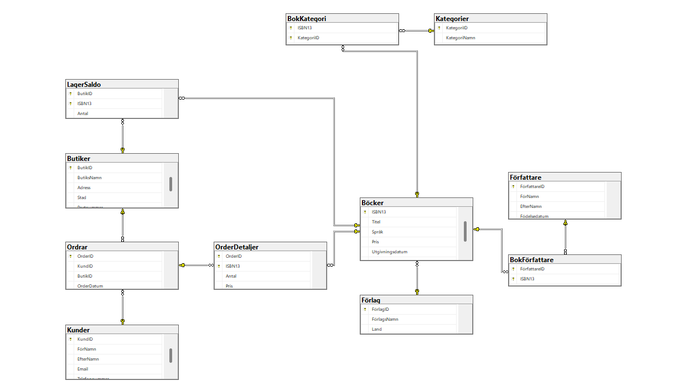

# Bokhandel – Databasprojekt

## Om projektet

Detta projekt är en databaslösning för en bokhandel utvecklad i SQL Server.  
Systemet hanterar böcker, författare, förlag, kategorier, butiker, kunder och beställningar.

Målet med projektet var att bygga en normaliserad databas med tydliga relationer och realistisk affärslogik för en bokhandel. Projektet innehåller även views, stored procedures och en Python-applikation som ansluter till databasen med SQLAlchemy.

---

## Teknologier

Projektet är utvecklat med:

- SQL Server
- SQL Server Management Studio (SSMS)
- Python
- SQLAlchemy
- Pandas
- Jupyter Notebook

---

## Databasdesign

Databasen består av flera relaterade tabeller för att hantera bokhandelns data på ett strukturerat sätt.

### Huvudtabeller

- Böcker
- Författare
- Förlag
- Butiker
- Kunder
- Ordrar

### Junction tables

För att hantera Many-to-Many relationer används följande junction tables:

- BokFörfattare
- BokKategori
- LagerSaldo
- OrderDetaljer

### Övriga tabeller

- Kategorier

---

## Relationer

Projektet innehåller både One-to-Many och Many-to-Many relationer.

## One-to-Many

- Ett förlag kan publicera flera böcker
- En kund kan skapa flera ordrar
- En butik kan hantera flera ordrar

## Many-to-Many

- En bok kan ha flera författare
- En författare kan skriva flera böcker
- En bok kan tillhöra flera kategorier
- En bok kan finnas i flera butiker
- En order kan innehålla flera böcker

Dessa relationer implementeras med hjälp av junction tables.

---

## ER-Diagram

---

## Views

### TitlarPerFörfattare

Denna vy sammanställer information om författare och deras böcker.

Vyn visar:

- Författarens namn
- Författarens ålder
- Antal titlar
- Totalt lagervärde av författarens böcker

Syftet med vyn är att ge bokhandeln en överblick över vilka författare som har flest titlar och hur stort värde deras böcker representerar i lagret.

---

### KundBeställningar

Denna vy sammanställer information om kunders köp och beställningar.

Vyn visar:

- Kundnamn
- Antal ordrar
- Totalt antal köpta böcker
- Totalt spenderat belopp

Informationen kan användas för kundanalys, marknadsföring och för att identifiera återkommande kunder.

## LagerPerKategori

Denna vy sammanställer information om böckers lagerstatus per kategori.

Vyn visar:

- Kategorinamn
- Antal titlar inom varje kategori
- Totalt antal böcker i lager
- Totalt lagervärde per kategori

Syftet med vyn är att hjälpa bokhandeln att analysera lagerstatus och lagervärde för olika kategorier. Informationen kan användas för lagerplanering , Inköpsbeslut ,Analys av populära kategorier ,Försäljningsstrategier

---

## Stored Procedure – Flytta_Böcker

Projektet innehåller stored proceduren `Flytta_Böcker` som används för att flytta böcker mellan butiker på ett säkert sätt.

Proceduren:

- Kontrollerar att butikerna finns
- Kontrollerar att boken finns i från-butiken
- Kontrollerar att tillräckligt antal exemplar finns
- Använder transactions
- Hanterar fel med TRY/CATCH
- Returnerar tydliga meddelanden vid lyckad eller misslyckad flytt

Detta hjälper till att säkerställa dataintegritet i systemet.

---

## Python-applikation

Python-programmet ansluter till databasen med hjälp av SQLAlchemy.

Programmet låter användaren:

- Söka efter böcker med fritextsökning
- Se hur många exemplar som finns i varje butik
- Visa resultat som pandas DataFrame

Applikationen använder parameteriserade queries för att skydda systemet mot SQL Injection.

---

## Säkerhet

För att skydda databasen används:

- Parameteriserade queries
- SQLAlchemy
- Begränsade databasrättigheter

Detta minskar risken för SQL Injection och otillåten åtkomst.

---

## Affärslogik

Databasen stödjer flera funktioner som är relevanta för en bokhandel, exempelvis:

- Lagerhantering
- Kundbeställningar
- Lageranalys
- Försäljningsanalys
- Hantering av flera författare och kategorier per bok
- Flytt av böcker mellan butiker

---

## Sammanfattning

Projektet utvecklades som en del av kursarbete inom databasutveckling och Python.